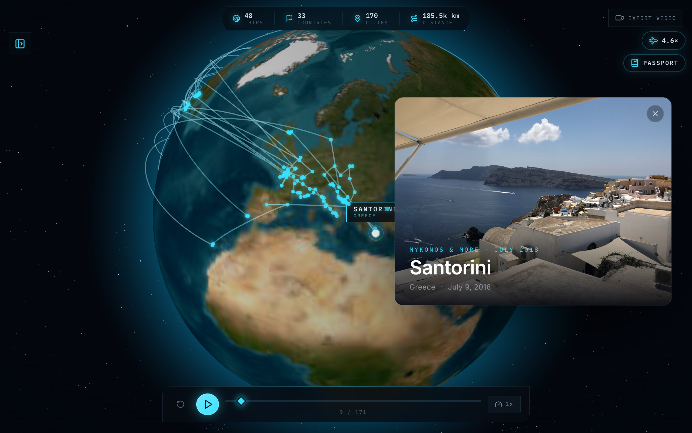
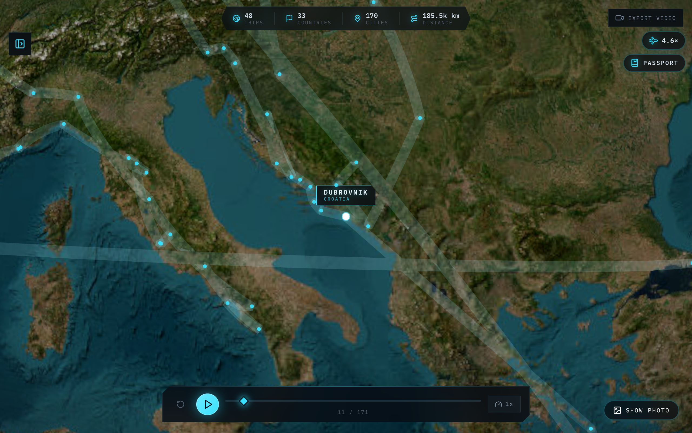
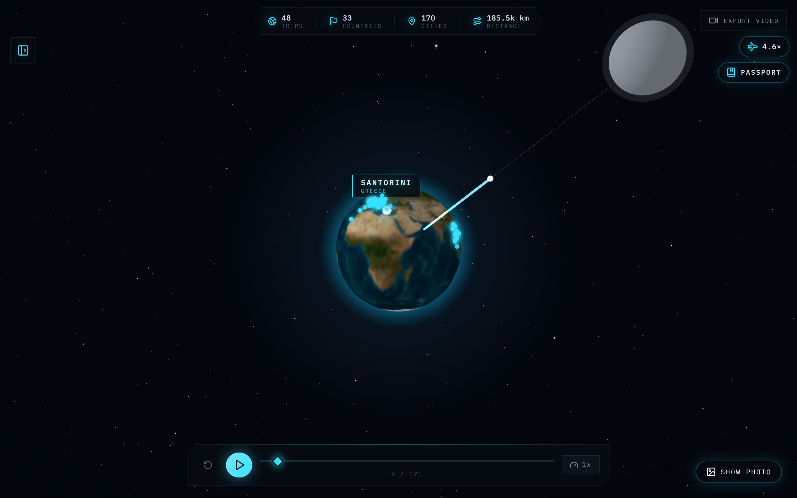
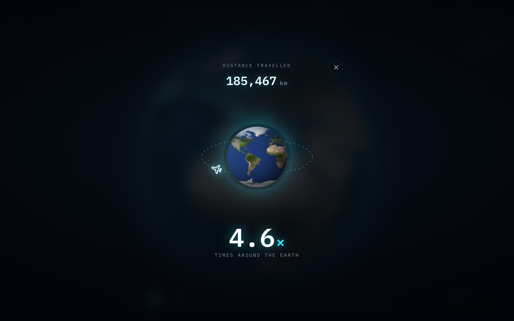
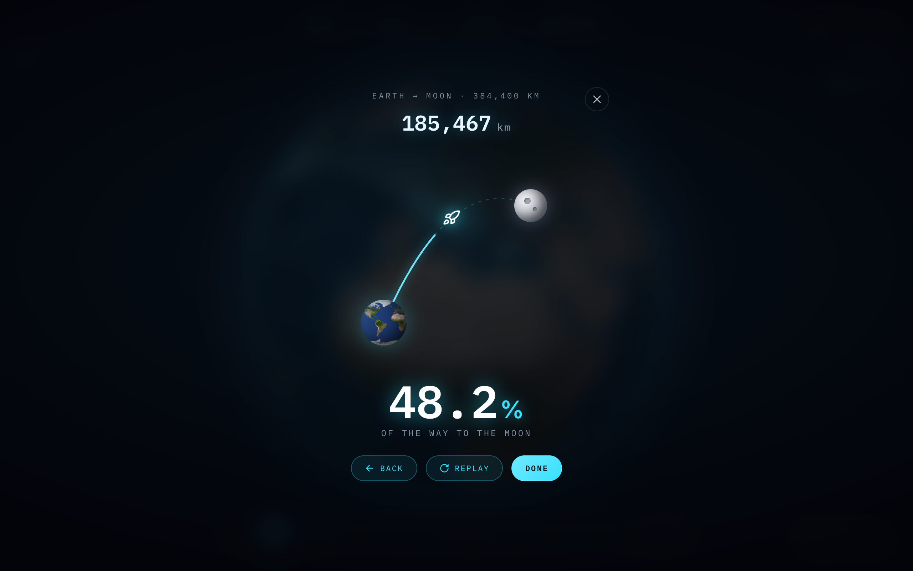
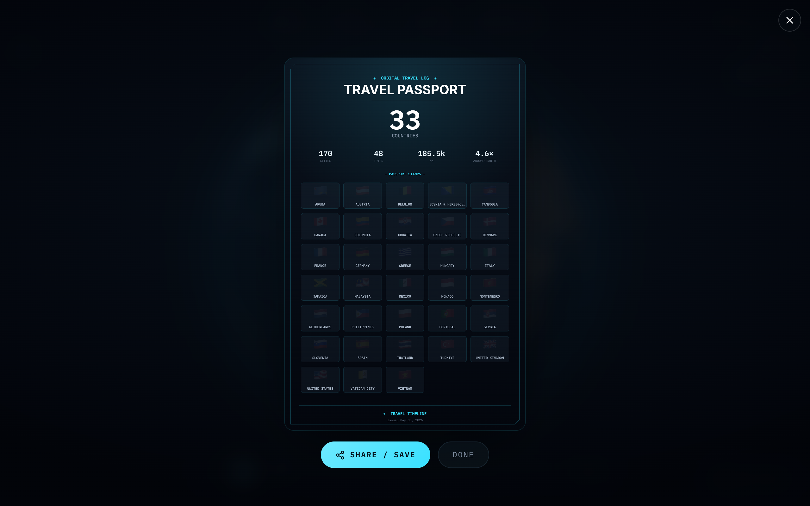

# Travel Timeline

**Connect your Apple Photos and it builds a beautiful, cinematic story of everywhere you've been — automatically.**

Travel Timeline scans your photo library, figures out the trips you took and the places you stayed, picks the single most beautiful photo from each place, and plays it all back as a smooth flythrough on a high-resolution **satellite** globe. The only input it needs from you is a time window.

---

## Demo

<p align="center">
  
</p>

<p align="center"><em>Your whole travel history as a cinematic flythrough — built automatically from Apple Photos. One beautiful photo per place, on a true satellite globe.</em></p>

<table>
  <tr>
    <td width="50%" valign="top">
      <br>
      <strong>True satellite globe</strong><br>
      Streams crisp ESRI World Imagery that sharpens as you zoom. Every place is a tappable marker — click one to jump to that moment and photo.
    </td>
    <td width="50%" valign="top">
      <br>
      <strong>Reach for the Moon</strong><br>
      Pull back into space and the city arcs dissolve into a single beam showing how far your travels carry you toward the Moon (384,400 km).
    </td>
  </tr>
  <tr>
    <td width="50%" valign="top">
      <br>
      <strong>Around the world</strong><br>
      A plane orbits a mini-Earth to show how many times your total distance circles the planet.
    </td>
    <td width="50%" valign="top">
      <br>
      <strong>…and on to the Moon</strong><br>
      A rocket charts your percentage of the 384,400 km journey from Earth to the Moon.
    </td>
  </tr>
  <tr>
    <td width="50%" valign="top">
      <br>
      <strong>Travel passport</strong><br>
      A shareable poster of your stats with a collected stamp for every country you've visited. (Flag stamps render in full color on device.)
    </td>
    <td width="50%" valign="top">
      <strong>…and more</strong><br><br>
      • Comfortable cinematic camera that arcs between places<br>
      • Scrub/seek timeline with adjustable speed<br>
      • Hide the photo card to admire the globe<br>
      • Starfield backdrop from a real star catalog<br>
      • 1080p video export (web)<br>
      • Runs on iOS, fully on-device
    </td>
  </tr>
</table>

---

## What it does

- **Zero-input story builder** — Point it at your Apple Photos library, choose a time window (1 / 3 / 5 / 10 years / All), and it does the rest: detects trips, identifies places, picks the best photo per place, and plays the result back. No manual entry required.
- **Every country, accurately labeled** — Uses Apple's own on-device reverse-geocode (the exact country the Photos app shows you) so coastal, island, and border locations are placed correctly. Guarantees a photo from **every international country** you've visited — even one-off trips.
- **One beautiful photo per place** — Instead of dumping every shot, it surfaces the single best "hero" photo for each stop, scored against your own library and learned from your Favorites. (See [How "beautiful" is decided](#how-beautiful-is-decided).)
- **True satellite globe** — Streams high-resolution ESRI World Imagery that sharpens as you zoom, with a glowing atmosphere and a starfield backdrop.
- **Comfortable cinematic camera** — The camera flies a smooth arc between places (lifts up, crosses, descends), scaled to distance, so big jumps feel like a flight rather than a dizzying skim.
- **Interactive playback** — Auto-play or scrub chronologically; click any place on the globe to jump straight to that moment and photo; hide the photo card anytime to admire the globe.
- **Friends** — Optional sign-in. Search a `@handle`, tap **Add** (instant — no request), then **View** to fly through their globe with the same photo card and city labels.
- **Cosmic perspective** — Playful "how far have I been" views: how many times your distance circles the Earth, how far it carries you toward the **Moon** (an animated rocket *and* a zoom-out beam right on the globe), and a shareable **travel passport** with a stamp for every country.
- **Video export** — Render a downloadable 1080p MP4 of the flythrough (in-browser reel, or 1080p on a Mac).
- **Local-first** — The globe works with no account. Photos stay on this machine unless you sign in, which syncs *derived places* and small hero thumbnails (never the camera roll).

---

## Prerequisites

- **macOS** — the Apple Photos integration reads the local `Photos.sqlite` database and uses `sips` for thumbnails.
- **Node.js 18+**
- **Full Disk Access** for your terminal / editor app, so it can read your Photos library:
  *System Settings → Privacy & Security → Full Disk Access → add your terminal (or Cursor / VS Code).*
- **Internet connection** — the globe streams satellite map tiles on demand (imagery only; your photos and trip data never leave your machine).
- **FFmpeg** on your `PATH` — required only for video export (`brew install ffmpeg`).
- **Google Chrome / Chromium** — required only for video export (Puppeteer can use your installed Chrome).

---

## Getting started

```bash
# Install dependencies (npm workspaces: installs client + server)
npm install

# Start the client and server together in development mode
npm run dev
```

- Client: http://localhost:5173
- Server: http://localhost:3001

On first launch (with no trips yet) the **Build Your Travel Story** panel opens automatically. Pick a time window and press **Build My Story**.

> **Tip:** A wider time window scans more photos and takes a little longer on the first build. Progress streams live. Start with **3 yr** to see results quickly, then try **All**.

### Production build

```bash
npm run build     # builds client (static) and server (dist/)
npm start         # one process: serves the client AND the API on :3001
```

In production the server hosts the built client itself (same origin, SPA
fallback included), so `http://localhost:3001` is the whole app.

**Share from this Mac** (friend on their own phone/laptop): `./serve-public.sh`.
That is a Cloudflare quick tunnel. Copy the `https://….trycloudflare.com` URL
and send it. Your Mac has to stay awake. After a rebuild, hard-refresh
(Cmd+Shift+R) so the service worker does not keep the old JS.

For Docker and an always-on host (Render), see
[docs/DEPLOYMENT.md](docs/DEPLOYMENT.md). Friends and accounts:
[docs/SOCIAL_SETUP.md](docs/SOCIAL_SETUP.md).

---

## How to use the app

### The automatic way (recommended)

1. Open the app — the **Build Your Travel Story** panel auto-opens on a fresh start.
2. Choose a time window (1 / 3 / 5 / 10 years / All) and click **Build My Story**.
3. Watch your travels play back on the globe.

### Controls

| Action | How |
| --- | --- |
| **Play / pause** the story | Play button in the timeline bar |
| **Scrub** to any point | Drag the timeline scrubber |
| **Jump to a place** | Click its dot on the globe — pauses and flies you there |
| **See a place's name** | Hover its dot (label appears) |
| **Change speed** | Speed button (0.5× / 1× / 2× / 4×) |
| **Hide the photo card** | The **✕** in the card's corner |
| **Show it again** | The **Show photo** pill (bottom-right) |
| **Reset to the globe view** | Reset button in the timeline bar |
| **Re-scan your photos** | Re-open **Build My Story** and rebuild |
| **Export a video** | **Export Video** button |
| **Sign in / friends** | People icon (top-right) |
| **Add a friend** | Search their `@handle`, tap **Add** |
| **View a friend's globe** | **View** — photo card and pins play back their story |

The globe is usable **without** an account. Sign in (email + password on the
web; Sign in with Apple on iOS) only if you want friends or to sync a map
across devices. Each account has its own map. This Mac's Photos library stays
on the unsigned-in guest globe; a friend who creates an account starts empty
and does not inherit your trips.

### Sharing the site from this Mac

```bash
./serve-public.sh
```

Needs `cloudflared` (`brew install cloudflared`) and `client/.env.local` with
Supabase keys so a friend can sign in. Leave the terminal open. Chrome may
warn that trycloudflare is a tunnel — that is expected.

### The manual way (optional)

1. Click **New Trip** in the trip panel.
2. Use the city search to add destinations and set arrival/departure dates.
3. Reorder destinations and attach photos as you like.
4. Use the timeline controls to play through them, then **Export Video**.

---

## How "beautiful" is decided

The macOS Photos library stores rich per-photo ML analysis. We read it **read-only** and turn it into a single, self-calibrating "beauty" score:

1. **Relative, not absolute** — every signal (aesthetics, curation, composition, lighting, immersiveness, color harmony, subject interest, sharpness, exposure, etc.) is converted to a **percentile rank within your own library**, so "beautiful" means "near the top of *your* photos," regardless of camera or era.
2. **Learned from your taste** — the signals are fused with weights learned from how strongly each one separates **your Favorites** from the rest. With too few Favorites to learn from, it falls back to neutral equal weighting.
3. **A nudge toward scenery** — for the establishing "hero" shot of a place, it gently favors clean, scenic, landscape-oriented frames over selfies.

The signals come from Apple's on-device aesthetic ML — never a hand-coded opinion of what looks good.

On top of scoring, the pipeline:

- **Excludes** screenshots, screen recordings, hidden, and trashed items.
- **De-dupes bursts** — rapid-fire frames collapse to the single best one.
- **Only uses locally-downloaded photos**, so nothing shows up as a broken image.

### Trip, place & country detection

- Photos are grouped into **places** using Apple's own **Moments** (coherent place+time groupings that already carry a human-readable title like "Mykonos").
- Everyday life is filtered out: your **home** area and **recurring local** spots (places you photograph across many separated days over a long span) are excluded, so the story is only real travel.
- Places are grouped into **trips** separated by multi-day gaps; a place you return to within a trip is merged into one stop (no duplicate cards).
- Markers land on the **medoid** of a place's photos (a real photo location), so a stray GPS point can't put a pin in the ocean.
- **Country** comes from Apple's own reverse-geocode (`ZREVERSELOCATIONDATA`), with an offline polygon lookup as a fallback — and the story is backfilled so **every international country with a photo** is represented.

---

## Architecture

```
client/                         React 19 + TypeScript + Vite frontend
  src/
    components/
      Globe/        GlobeView (satellite globe + markers), RenderView (export), Starfield, FeaturedDestination (photo card)
      Layout/       AppLayout, HudFrame (subtle vignette), StatsBar
      Social/       sign-in, friends, leaderboards, view-a-friend's-globe
      Timeline/     TimelineBar (playback controls)
      TripManager/  TripPanel, TripCard, ApplePhotosImport (story builder), CitySearch, photo components
      VideoExport/  VideoExportButton
    stores/         Zustand state (tripStore, globeStore, uiStore, authStore)
    services/       photoSource, travelSync, social (Supabase)
    utils/          camera (arc flight), animation, storage, geocoding helpers
  public/           Earth textures + base imagery
  supabase/         schema.sql (profiles, places, friendships, heroes bucket)

server/                         Express backend (the macOS-specific work the browser can't do)
  src/
    routes/         API endpoints (apple-photos, video)
    services/
      applePhotos.ts  Photos DB access, beauty scoring, Moment grouping, trip inference, thumbnails
      geo.ts          Apple reverse-geo decoder + offline country fallback + names
      renderer.ts     Puppeteer + FFmpeg video renderer
```

### Server endpoints

- `GET  /health` — liveness check.
- `GET  /api/apple-photos/status` — whether the Photos DB is accessible (and why not).
- `POST /api/apple-photos/import` — streams progress (SSE) and returns inferred trips + the hero photo per place. Body: `{ "yearsBack": number }`.
- `GET  /api/apple-photos/photo?dir=&file=&w=` — serves a cached, resized thumbnail for a photo.
- `POST /api/apple-photos/clear-cache` — clears the in-memory photo/trip caches.
- `POST /api/render-video` / `GET /api/download-video` — render and download the flythrough MP4.

### How the globe stays crisp

The globe uses **globe.gl's tile engine** backed by **ESRI World Imagery**: it streams progressively finer satellite tiles as the camera approaches (up to ~street-block detail), so cities stay sharp instead of blurring like a single baked texture. The camera arc lives in `client/src/utils/camera.ts`.

---

## Tech stack

- React 19 + TypeScript + Vite
- globe.gl + three.js (3D satellite globe)
- Zustand (state management)
- Tailwind CSS v4 + CSS Modules
- Express.js (server)
- better-sqlite3 (read-only Apple Photos database access)
- bplist-parser (decode Apple's reverse-geocode archives) + coordinate_to_country (offline country fallback)
- Puppeteer + FFmpeg (video rendering)

---

## Privacy

Travel Timeline is local-first. The globe works with no account. Your Photos
database is opened **read-only**, thumbnails are generated and served locally,
and the unsigned-in map is stored in this browser's `localStorage`.

If you **sign in**, derived *places* (city, country, dates, a lat/lng) and one
small hero thumbnail per place sync to Supabase so friends can view your globe
and so your phone and laptop stay in step. The camera roll itself is never
uploaded. Sign out and this Mac's guest library is still here.

The only other outbound traffic is fetching **satellite map tiles** for the
globe (coordinates only — never your photos).

Social setup: [docs/SOCIAL_SETUP.md](docs/SOCIAL_SETUP.md).

---

## Troubleshooting

- **"Photos database not accessible"** — grant **Full Disk Access** to your terminal/editor (see Prerequisites), then restart it.
- **Some countries are missing** — those photos are likely only in iCloud and not downloaded to this Mac (there's no local image to show), or were taken with location services off. Download the originals in Photos and rebuild.
- **The globe is blank / no imagery** — the satellite tiles need an internet connection.
- **White screen after a rebuild** — hard-refresh (Cmd+Shift+R). The service worker must not keep a stale `index.html`.
- **Chrome calls the trycloudflare URL "Dangerous"** — expected for a quick tunnel; the site is still yours.
- **A new account showed this Mac's globe** — that was a leak; accounts are isolated now. Sign out to get the Photos library back. A friend who signs in starts empty.
- **Video export fails** — ensure `ffmpeg` is installed and on your `PATH`, and that Google Chrome is installed.
- **Stale results after rebuilding** — your previous story is cached in the browser; re-open **Build My Story** to regenerate.

---

## Known limitations & roadmap

- **iCloud-only photos** can't be shown (no local file). A fallback to Apple's cached derivative thumbnails could unlock them.
- **Place naming** occasionally inherits an Apple Moment title that's a holiday rather than a place; a geocoded place-name fallback is planned.
- **Video export** caches the rendered MP4 in memory keyed by client, which is fragile for multi-user use.
